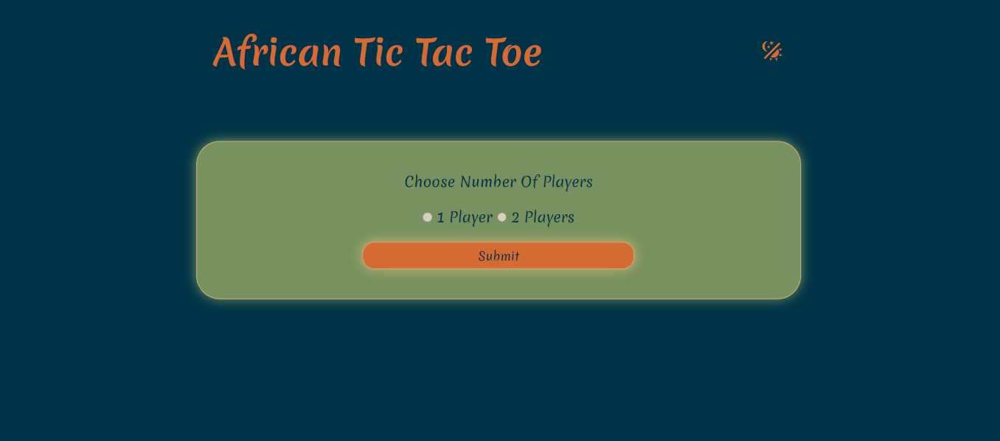

# Africa-Themed Tic-Tac-Toe

## Table of Contents

- [Introduction](#introduction)
- [Technologies](#technologies)
- [Setup](#setup)
- [Project Status](#project-status)
- [Challenges Faced](#challenges-faced)
- [Future Implementation](#future-implementation)
- [Acknowledgements](#acknowledgements)
- [Contact](#contact)

## Introduction

This is an in-browser tic tac toe game. Currently, the game is implemented to acept two players, and the option to have a one player game with the computer shall be implemented later.

## Technologies

HTML, CSS and Javascript

## Setup

To play the game, click the link below to go to the live website hosted by Github pages:
[Africa-Themed Tic-Tac-Toe](https://athenacats.github.io/africa-themed-tic-tac-toe/)

## Project Status

The project is complete as is for the two-player version, with the AI one-player version to be implemented later.

## Challenges Faced

The biggest challenge that I faced initially was the implementation of factory functions and figuring out the scope of my different functions. I found it difficult to track which functions would be called and accessible at what point, so I took a lot of time watching videos and reading up on scope.

## Future Implementation

- Implement the ai version of the game, perhaps with three levels of difficulty that a user can select. Likely this shall be done using the minimax algorithm, and percentages shall be used to determine the thoroughness of the algorithm
- Highlight the row/column that has won once a player wins
- Add a celebratory animation that pops up for winner / taunting or encouraging message for the loser

## Acknowledgements

This project is an assignment instructed from [The Odin Project](https://www.theodinproject.com/lessons/node-path-javascript-tic-tac-toe). It was done from scratch through research from various informational sources.

## Contact

Reach me on [LinkedIn](https://www.linkedin.com/in/esther-lonyangapuo/) [Email](mailto:chenalonya@gmail.com)
